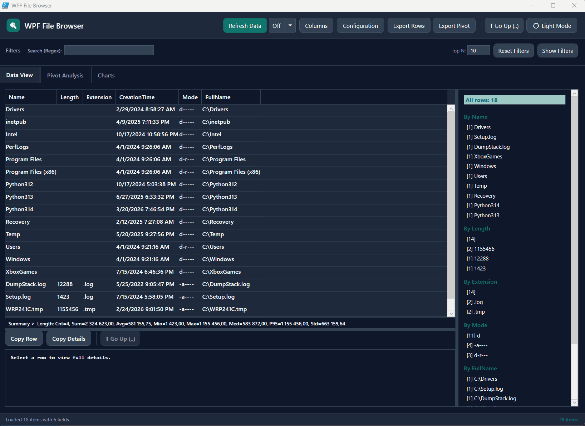

# Dynamic Data Viewer (WPF)

A highly interactive, dynamic, and generic WPF-based user interface for visualizing, filtering, grouping, and analyzing any collection of PowerShell objects (`PSCustomObject`). 

Whether you are parsing event logs, monitoring active processes, or analyzing CSV data, this tool instantly spins up a feature-rich, modern dashboard without requiring you to write custom UI code.

## Key Features

- **Automatic Data Grid**: Automatically generates columns based on the properties of the objects you pass to it. Supports interactive sorting, reordering, and resizing. When no column list is supplied, the viewer prefers the object's built-in default display properties (similar to Format-Table) and only falls back to all discovered fields when needed.
- **Inline Editing**: Use the `-AllowEdit` switch to allow modifying data directly within the grid. Changes instantly synchronize with the underlying objects, dynamic filter options, and group-by counts.
- **Dynamic Filter Panel**: Automatically detects data types (e.g., `DateTime`, low-cardinality strings, high-cardinality values) and provisions appropriate filter controls (DatePickers, ComboBoxes, TextBoxes). Correctly handles and groups `null` or empty values under an `(Empty)` label.
- **Details Pane**: Displays the full details of the currently selected row in a scrollable view. Perfect for reading long string values (like stack traces or event log messages).
- **Group By Analysis**: Group your data by any column, calculate item counts, and display the Top N results dynamically.
- **Built-in Charts**: Generate Bar and Pie charts directly from your data properties without any external dependencies. Export charts directly to PNG.
- **Asynchronous Refresh & Auto-Refresh**: Supports an asynchronous refresh scriptblock (`-RefreshScript`). Pull fresh data in the background using `Start-Job` while keeping the UI completely responsive. You can configure automatic polling intervals (5s, 30s, 1m) directly from the UI.
- **State Persistence**: Column widths, custom reordering, active filters, and sorting choices perfectly persist across background refreshes and tool restarts.
- **Robust Security & Performance**: Built-in Excel Formula Injection protection on CSV exports, Regex DoS timeouts for large-scale filtering, and automatic clipboard masking for sensitive properties (Passwords, Tokens, API Keys).
- **Intelligent Formatting**: Gracefully unwraps and extracts clean string representations for complex nested objects, generic collections (`IEnumerable`), and system handles (`SafeHandle`).
- **Color Mapping**: Color-code rows based on specific property values (e.g., Red for "Error", Yellow for "Warning").
- **Modern Themes**: Fully implemented dynamic Light and Dark mode, complete with native Windows DWM dark title bars. Theme preferences and column configurations are automatically saved to your user profile (`%APPDATA%\DynamicDataViewer`).
- **File Explorer Mode**: A built-in switch (`-FileExplorerMode`) instantly transforms the viewer into a high-performance File Browser with double-click navigation, automatic background refresh, and configurable file-reading logic.

## File Explorer Mode

The viewer features a built-in `-FileExplorerMode` switch that instantly converts it into a fully functional, high-performance WPF File Browser out of the box!

```powershell
Show-DataViewer -FileExplorerMode -Title "My File Browser"
```



When activated, the script automatically:
- Injects a high-performance background script to list files and optionally read character prefixes.
- Binds native **Double-Click** actions to open files and enter directories.
- Adds **"Go Up (..)"** navigation buttons to the dataset and row levels.
- Pre-fetches the starting directory (Defaults to `C:\`, overridable via `-Configuration @{ CurrentPath = 'D:\' }`).

## Prerequisites

- **PowerShell 5.1** or higher.
- **Windows OS** (relies on WPF / `PresentationFramework`).

## Basic Usage

The easiest way to use the viewer is to pipe an array of custom objects directly into the `Show-DataViewer` function.

```powershell
# 1. Dot-source the script to load the function
. .\Dynamic_DataViewer_WPF.ps1

# 2. Gather some data
$data = Get-Process | Select-Object Name, Id, WorkingSet, Handles, CPU

# 3. Launch the viewer
$data | Show-DataViewer -Title "Process Monitor"
```

## Advanced Usage

For more complex scenarios, you can provide an asynchronous refresh script, configure column visibility, and apply custom color mappings. Check examples below.

```powershell
# Define how to fetch new data
$refreshScript = { 
    Get-EventLog -LogName System -Newest 500 | 
    Select-Object EventID, EntryType, Source, TimeGenerated, Message 
}

# Define color rules
$colorMapping = @{
    EntryType = @{
        'Error'    = '#FECACA'  
        'Warning'  = '#FEF3C7'  
        'Critical' = '#FCA5A5'
    }
}

# Define initial columns
$columns = @('TimeGenerated', 'EntryType', 'Source', 'EventID', 'Message')

# Launch
Show-DataViewer -Data (& $refreshScript) `
                -Title "System Event Logs" `
                -RefreshScript $refreshScript `
                -ColorMapping $colorMapping `
                -Columns $columns `
                -GroupByTopN 15
```

## Parameters

| Parameter | Type | Description |
| :--- | :--- | :--- |
| **`Data`** | `[PSCustomObject[]]` | The array of objects to display. Accepts pipeline input. |
| **`RefreshScript`** | `[scriptblock]` | Optional scriptblock executed asynchronously when the "Refresh" button is clicked. It must return an array of objects. |
| **`Configuration`** | `[hashtable]` | Optional hashtable for passing additional internal configurations. |
| **`Columns`** | `[string[]]` | Array of property names defining the initial order and visibility of columns. If omitted, the viewer initially shows the source object's default display properties (for example, the columns PowerShell would show in Format-Table) when available; otherwise it falls back to all discovered properties. |
| **`ColorMapping`** | `[hashtable]` | A hashtable mapping specific cell string values to WPF brush colors (e.g., `@{ "Error" = "Red" }`). |
| **`Title`** | `[string]` | The title displayed in the window header. Default is "Data Viewer". |
| **`GroupByTopN`** | `[int]` | The default number of top values to display in the Group By analysis tab. Default is `10`. |
| **`Actions`** | `[hashtable[]]` | Optional array of action definitions. Each action is a hashtable with keys described below. |
| **`AllowEdit`** | `[switch]` | Enables inline editing directly within the DataGrid. Edited values update the underlying custom object and instantly reflect in filter controls and group-by counts. |
| **`FileExplorerMode`** | `[switch]` | Automatically configures the viewer as a fully functional WPF-based File Browser. Injects background scripts, navigation actions, and pre-fetches initial data. |

## Custom Actions

Custom Actions allow you to extend the viewer with your own operations that work on individual rows or the entire filtered dataset. Actions appear as buttons in the UI and their results are shown back to you.

### Action Hashtable Schema

Each action is defined as a hashtable with the following keys:

| Key | Type | Required | Description |
|---|---|---|---|
| `Name` | `string` | ✅ | Display label for the button (e.g. `"Kill Process"`, `"Export to CSV"`). Ignored if `Scope` is `DoubleClick`. |
| `Script` | `scriptblock` | ✅ | The code to execute. Receives two parameters: `$ActionData` (the selected row or filtered array) and `$ActionContext` (a hashtable with `SelectedRow`, `AllData`, `FilteredData`, `Window`, and `Configuration`) |
| `Scope` | `string` | ✅ | `"Row"` — button appears near Copy Row and is enabled only when a row is selected.<br>`"Dataset"` — button appears in the header toolbar and operates on all filtered items.<br>`"Both"` — button appears in both locations.<br>`"DoubleClick"` — natively binds the scriptblock to the DataGrid's `MouseDoubleClick` event instead of rendering a button. |
| `Icon` | `string` | ❌ | Optional emoji/unicode prefix for the button (e.g. `"⚡"`, `"📋"`) |
| `ReturnToGrid` | `bool` | ❌ | If `$true`, the grid is refreshed after execution to reflect any property changes or additions made by the scriptblock. Default: `$false` |

### Example 

```powershell
    $refreshScript = {
        Get-Process | Select-Object Name, Id, CPU, Handles
    }

    $actions = @(
        @{
            Name = 'Kill Process'
            Scope = 'Row'
            ReturnToGrid = $true
            Script = {
                param($ActionData, $ActionContext)
                Stop-Process -Id $ActionData.Id -Force -ErrorAction SilentlyContinue
                'Stopped {0}' -f $ActionData.Name
            }
        },
        @{
            Name = 'Mark Reviewed'
            Scope = 'Row'
            ReturnToGrid = $true
            Script = {
                param($ActionData, $ActionContext)
                $ActionData | Add-Member -NotePropertyName Reviewed -NotePropertyValue $true -Force
                'Marked {0} as reviewed.' -f $ActionData.Name
            }
        }
    )

    Show-DataViewer -Data (& $refreshScript) `
        -RefreshScript $refreshScript `
        -Title 'Process Viewer' `
        -Actions $actions
```

### Where Action Buttons Appear

- **Row actions** (`Scope = "Row"`) appear next to the **Copy Row** / **Copy Details** buttons in the details pane area. They are disabled when no row is selected.
- **Dataset actions** (`Scope = "Dataset"`) appear in the header toolbar, next to the Export buttons.
- **Both** (`Scope = "Both"`) creates a button in both locations.
- **Double Click** (`Scope = "DoubleClick"`) does not create a button. Instead, it securely binds your action directly to the data grid's native `MouseDoubleClick` event.

### Result Handling

- If the scriptblock returns a **string**, it is shown in a MessageBox (for Row/Dataset) or in the status bar (for ReturnToGrid actions).
- If the scriptblock returns **objects**, they are formatted and displayed in a MessageBox.
- If `ReturnToGrid` is `$true`, the grid is refreshed after execution. If the scriptblock added new properties (via `Add-Member`), the viewer automatically discovers them, adds new columns, generates dynamic filter controls, and makes them available for Pivot and Group By analysis.
- Errors are caught and displayed in an error dialog.

### Example 1

```powershell
    $categories = @('Alpha', 'Beta', 'Gamma', 'Delta', 'Epsilon')
    $levels = @('Info', 'Warning', 'Error', 'Critical')
    $users = @('admin', 'john.doe', 'jane.smith', 'bob.jones', 'alice.wang', 'dev.test')
    $servers = @('SRV01', 'SRV02', 'SRV03')

    $data = 1..200 | ForEach-Object {
        [PSCustomObject]@{
            ID       = $_
            Name     = "Item-$($_.ToString('D4'))"
            Category = $categories[$_ % $categories.Count]
            Level    = $levels[$_ % $levels.Count]
            User     = $users[$_ % $users.Count]
            Server   = $servers[$_ % $servers.Count]
            Created  = (Get-Date).AddDays( - ($_ * 0.5)).AddHours( - (Get-Random -Max 24))
            Value    = [math]::Round((Get-Random -Minimum 1 -Maximum 10000) / 100, 2)
            Message  = "This is a sample message for item $_ with some searchable text content."
            IsActive = ($_ % 3 -ne 0)
        }
    }
    $colorMapping = @{
        Level = @{
            Error = '#FECACA'
            Warning = '#FEF3C7'
        }
    }

    Show-DataViewer -Data $data -ColorMapping $colorMapping -Title 'Colored Events'
    
    #or 
    $colorMapping = @{
         Level = @{
             Error = [System.ConsoleColor]::DarkRed
             Warning = 'Yellow'
         }
     }
    Show-DataViewer -Data $data -ColorMapping $colorMapping -Title 'Colored Events'
```

### Example 2

```powershell
    $refreshScript = {
        Get-Process | Select-Object Name, Id, CPU, Handles
    }

    $actions = @(
        @{
            Name = 'Kill Process'
            Scope = 'Row'
            ReturnToGrid = $true
            Script = {
                param($ActionData, $ActionContext)
                Stop-Process -Id $ActionData.Id -Force -ErrorAction SilentlyContinue
                'Stopped {0}' -f $ActionData.Name
            }
        },
        @{
            Name = 'Mark Reviewed'
            Scope = 'Row'
            ReturnToGrid = $true
            Script = {
                param($ActionData, $ActionContext)
                $ActionData | Add-Member -NotePropertyName Reviewed -NotePropertyValue $true -Force
                'Marked {0} as reviewed.' -f $ActionData.Name
            }
        }
    )

    Show-DataViewer -Data (& $refreshScript) `
        -RefreshScript $refreshScript `
        -Title 'Process Viewer' `
        -Actions $actions
```

### EXAMPLE 3: Interactive File Browser (Double-Click & Config Injection) with X first chars of each file.

```powershell
    # 1. Define the configuration for the DataViewer.
    $config = @{
        CurrentPath = 'C:\'
        CharactersToRead = 100
    }

    # 2. Define the Refresh Script. 
    # It runs in a background job and automatically gets $CurrentPath from the config!
    $refreshScript = {
        # <- This is the magic! It gets injected automatically by Show-DataViewer.
        function read_first_X_chars {
            param($path,[int]$Chars = 100)
            #test if its a file or directory
            if (-not (Test-Path -Path $path)) {
                #Write-Output "File not found: $path"
                return
            }
            if ((Get-Item -Path $path).PSIsContainer) {
                return
            }
            $reader = [System.IO.StreamReader]::new($path)

            # Create a buffer for the specified number of characters
            $buffer = [char[]]::new($Chars)

            # Read up to the specified number of characters into the buffer
            $charsRead = $reader.Read($buffer, 0, $Chars)

            # Clean up
            $reader.Close()
            $reader.Dispose()

            # Join the array back into a string (handling files smaller than X chars)
            $result = -join $buffer[0..($charsRead - 1)]
            $singleLineResult = $result -replace '\r?\n', ' '

            Write-Output $singleLineResult
        }
        Get-ChildItem -Path $CurrentPath -ErrorAction SilentlyContinue | 
        Select-Object Name, Length, Extension, CreationTime, Mode, FullName, @{Name='FirstChars';Expression={read_first_X_chars $_.FullName $CharactersToRead  }}
    }

    # 3. Define our Custom Actions using the brand new 'DoubleClick' scope!
    $actions = @(
        @{
            Name         = 'Enter / Open'
            Scope        = 'DoubleClick'  # <--- Natively binds to DataGrid MouseDoubleClick!
            ReturnToGrid = $false
            Script       = {
                param($Data, $Context)
                    
                if ($Data.Mode -match 'd') {
                    # It's a directory! Update the CurrentPath in the viewer's configuration.
                    $Context.Configuration['CurrentPath'] = $Data.FullName
                        
                    # Automatically click the 'Refresh Data' button to fetch the new directory
                    $btnRefresh = $Context.Window.FindName('btnRefresh')
                    if ($btnRefresh) {
                        $btnRefresh.RaiseEvent([System.Windows.RoutedEventArgs]::new([System.Windows.Controls.Primitives.ButtonBase]::ClickEvent))
                    }
                }
                else {
                    # It's a file! Open it with Windows.
                    Invoke-Item -Path $Data.FullName
                }
            }
        },
        @{
            Name         = 'Go Up (..)'
            Scope        = 'Row' # Puts it right next to the Copy buttons, as requested!
            Icon         = '⬆️'
            ReturnToGrid = $false
            Script       = {
                param($Data, $Context)
                    
                # Read the current path directly from the viewer's configuration
                $currentPath = $Context.Configuration['CurrentPath']
                $parent = Split-Path -Path $currentPath -Parent
                    
                if ($parent) {
                    # Update the configuration with the parent path
                    $Context.Configuration['CurrentPath'] = $parent
                        
                    # Automatically click the 'Refresh Data' button
                    $btnRefresh = $Context.Window.FindName('btnRefresh')
                    if ($btnRefresh) {
                        $btnRefresh.RaiseEvent([System.Windows.RoutedEventArgs]::new([System.Windows.Controls.Primitives.ButtonBase]::ClickEvent))
                    }
                }
            }
        },
        @{
            Name         = 'Go Up (..)'
            Scope        = 'Dataset' # <--- Changed from 'Row' to 'Dataset'
            Icon         = '⬆️'
            ReturnToGrid = $false
            Script       = {
                param($Data, $Context)
                    
                # Read the current path directly from the viewer's configuration
                $currentPath = $Context.Configuration['CurrentPath']
                $parent = Split-Path -Path $currentPath -Parent
                    
                if ($parent) {
                    # Update the configuration with the parent path
                    $Context.Configuration['CurrentPath'] = $parent
                        
                    # Automatically click the 'Refresh Data' button
                    $btnRefresh = $Context.Window.FindName('btnRefresh')
                    if ($btnRefresh) {
                        $btnRefresh.RaiseEvent([System.Windows.RoutedEventArgs]::new([System.Windows.Controls.Primitives.ButtonBase]::ClickEvent))
                    }
                }
            }
        })
    # 4. Fetch the initial data and launch the viewer
    #replace with $refreshscript and pass the current path to it
    $CurrentPath = $config.CurrentPath
    $CharactersToRead = $config.CharactersToRead
    $initialData = invoke-command -scriptblock $refreshScript 

    Show-DataViewer -Data $initialData `
        -Title "WPF File Browser" `
        -Configuration $config `
        -RefreshScript $refreshScript `
        -Actions $actions
```

### EXAMPLE 4

```powershell
    $categories = @('Alpha', 'Beta', 'Gamma', 'Delta', 'Epsilon')
    $levels = @('Info', 'Warning', 'Error', 'Critical')
    $users = @('admin', 'john.doe', 'jane.smith', 'bob.jones', 'alice.wang', 'dev.test')
    $servers = @('SRV01', 'SRV02', 'SRV03')

    $data = 1..200 | ForEach-Object {
        [PSCustomObject]@{
            ID       = $_
            Name     = "Item-$($_.ToString('D4'))"
            Category = $categories[$_ % $categories.Count]
            Level    = $levels[$_ % $levels.Count]
            User     = $users[$_ % $users.Count]
            Server   = $servers[$_ % $servers.Count]
            Created  = (Get-Date).AddDays( - ($_ * 0.5)).AddHours( - (Get-Random -Max 24))
            Value    = [math]::Round((Get-Random -Minimum 1 -Maximum 10000) / 100, 2)
            Message  = "This is a sample message for item $_ with some searchable text content."
            IsActive = ($_ % 3 -ne 0)
        }
    }
    $actions = @(
        @{
            Name  = 'Show Details'
            Scope = 'Row'
            Script = {
                param($ActionData, $ActionContext)
                'Selected: ' + $ActionData.Name
            }
        }
    )

    Show-DataViewer -Data $data `
        -Title 'Interactive Viewer' `
        -Columns @('Name','Category','Level','Value') `
        -Actions $actions `
        -AllowEdit
```


## UI Guide

### 1. Data Grid Tab
The primary view of your data. 
- **Inline Editing**: If started with `-AllowEdit`, simply double-click any cell to edit its value.
- **Auto-Refresh**: If a `-RefreshScript` is provided, use the dropdown in the top bar to set an auto-refresh polling interval (Off, 5s, 30s, 1m). All active filters, sorts, and custom column widths are preserved seamlessly during refreshes!
- **Column Chooser**: Click the **Columns** button in the top right to open a configuration dialog where you can toggle column visibility and order.
- **Filtering**: Click **Show Filters** to open the dynamic filter pane. You can filter multiple columns simultaneously. Missing or null data can be filtered using the `(Empty)` option.
- **Details**: Select any row to populate the bottom Details pane. Use **Copy Row** or **Copy Details** to send data to the clipboard. (Note: Sensitive fields like passwords and API keys are automatically masked during clipboard operations for security).
- **Custom Actions**: If actions were provided, Row-scoped action buttons appear next to the Copy buttons. Dataset-scoped action buttons appear in the header toolbar.

### 2. Group By Tab
Use this tab to aggregate your dataset.
- Select a field from the **GROUP BY** dropdown.
- Adjust the **TOP N VALUES** limit to truncate the list.
- Click **Analyze** to generate a frequency table.

### 3. Charts Tab
Visualize the distribution of your data.
- **FIELD**: The property you want to chart.
- **CHART TYPE**: Choose between **Bar** or **Pie**.
- **Group remaining as 'Other'**: Check this to collapse long-tail data (values beyond the Top N limit) into a single "Other" slice/bar.
- **Export**: Click **Export to PNG** to save the current chart directly to your hard drive.

### 4. Theming
Toggle the **☀️ / 🌙** button in the top-right corner to switch between Light and Dark modes. The viewer automatically remembers your preference across sessions by saving a configuration file in `$env:APPDATA\DynamicDataViewer\settings.json`.


# User Guide

`Show-DataViewer` is a powerful, interactive WPF-based data viewer for PowerShell objects. It allows you to display, filter, analyze, chart, and even edit collections of `PSCustomObject` items in a sleek desktop window.

This guide will walk you through everything from the simplest use cases to the most advanced technical implementations.

---

## 1. Getting Started: The Basics

The most fundamental way to use `Show-DataViewer` is to pass it some data. The viewer accepts an array of `PSCustomObject` items, either via the `-Data` parameter or directly from the pipeline.

### Basic Usage
> [!TIP]
> You can easily visualize the output of built-in cmdlets by piping them into `Show-DataViewer`.

```powershell
# Get a list of processes and show them in the viewer
Get-Process | Select-Object Name, Id, CPU, Handles | Show-DataViewer
```

### Specifying Data Explicitly and Setting a Title
You can provide data via the `-Data` parameter and customize the window title using `-Title`.

```powershell
$data = Get-Service | Select-Object Name, DisplayName, Status, StartType
Show-DataViewer -Data $data -Title "Windows Services Viewer"
```

### Enabling Inline Editing
You can make the data grid editable by adding the `-AllowEdit` switch. This allows users to double-click cells and edit their values directly in the window! 
When a cell is edited, the underlying PowerShell object is instantly updated in your session, and any active filters or groupings are refreshed.

```powershell
# Example 1: Make the services editable
Show-DataViewer -Data $data -AllowEdit -Title "Editable Services Viewer"
```

```powershell
# Example 2: Edit a user list and process the changes afterwards
$users = @(
    [PSCustomObject]@{ ID = 1; Name = 'Alice'; Role = 'Admin'; IsActive = $true }
    [PSCustomObject]@{ ID = 2; Name = 'Bob'; Role = 'User'; IsActive = $false }
    [PSCustomObject]@{ ID = 3; Name = 'Charlie'; Role = 'User'; IsActive = $true }
)

# Open the viewer and wait for the user to close it
Show-DataViewer -Data $users -AllowEdit -Title "Manage Users"

# After the window is closed, the $users array contains all the edits made in the UI!
$users | Where-Object { $_.IsActive } | Export-Csv -Path "ActiveUsers.csv" -NoTypeInformation
```

> [!WARNING]
> Editing data modifies the objects in memory. Ensure your script handles these modifications appropriately if you plan to save them back to a database or file, as demonstrated in the second example above.

---

## 2. Customizing the View

You can customize what data is shown by default and apply conditional formatting to make important rows stand out.

### Selecting Specific Columns
By default, the viewer displays properties based on the object's default display set or all discovered properties. Use `-Columns` to specify exactly which columns should be visible initially. (Users can still toggle other columns from the UI using the "Columns" button).

```powershell
$data = Get-Process
Show-DataViewer -Data $data -Columns @('Name', 'CPU', 'WorkingSet') -Title "CPU Monitor"
```

### Conditional Formatting with Color Mapping
The `-ColorMapping` parameter lets you highlight entire rows based on specific property values. It takes a nested hashtable where the outer key is the Property Name, and the inner keys are the matching values and their colors.

**How to specify colors:**
Because `Show-DataViewer` is built on WPF, you can specify colors in several ways:
1. **Hexadecimal Code**: Like `#FF0000` (Red) or `#FEF3C7` (Soft Yellow).
2. **Standard WPF Color Names**: Like `Red`, `DarkRed`, `LightGreen`, `CornflowerBlue`, etc.

```powershell
$data = @(
    [PSCustomObject]@{ Service = 'Web'; Status = 'Running'; Priority = 'High' }
    [PSCustomObject]@{ Service = 'DB'; Status = 'Stopped'; Priority = 'Critical' }
    [PSCustomObject]@{ Service = 'Cache'; Status = 'Running'; Priority = 'Low' }
)

$colors = @{
    # We want to format based on the "Status" property
    Status = @{
        'Stopped' = '#FECACA'    # Using Hex Code
        'Running' = 'LightGreen' # Using Named Color
    }
}

Show-DataViewer -Data $data -ColorMapping $colors -Title "Service Status"
```

---

## 3. Analytical Features

Once your data is loaded, the UI offers powerful built-in tools:
- **Filters**: Auto-detects field types and builds filter controls automatically (Dropdowns, Text searches, Date ranges).
- **Details Pane**: Click any row to see its full properties in a formatted view.
- **Group By Panel**: Easily aggregate data. You can control how many top values are shown with `-GroupByTopN` (default is 10).
- **Pivot Analysis & Charts**: Build pivot tables and charts directly in the UI, and export them to PNG!

```powershell
# Lowering the Top N limit for the Group By panel
Get-Process | Show-DataViewer -GroupByTopN 5
```

---

## 4. Hardcore / Technical Examples

For advanced automation and tool-building, `Show-DataViewer` supports dynamic refreshing, custom actions (buttons), and runtime configuration.

### Custom Actions
You can define custom buttons that execute PowerShell scripts against your data. The `-Actions` parameter takes an array of hashtables. Each action defines:
- **`Name`**: The label of the button.
- **`Scope`**: Where the action applies. `Row` (acts on the selected row), `Dataset` (acts on the entire grid), or `Both`.
- **`Script`**: The ScriptBlock to execute. It receives two parameters: `$ActionData` and `$ActionContext`.
    - `$ActionData`: If Scope is `Row`, this is the single `PSCustomObject` selected. If Scope is `Dataset`, it's the entire array of data.
    - `$ActionContext`: Contextual information about the viewer.
- **`ReturnToGrid`**: If `$true`, the string returned by the script is displayed in the viewer's status bar.

```powershell
$actions = @(
    @{
        Name = 'Kill Process'
        Scope = 'Row'
        ReturnToGrid = $true
        Script = {
            param($ActionData, $ActionContext)
            Stop-Process -Id $ActionData.Id -Force -ErrorAction SilentlyContinue
            return "Stopped $($ActionData.Name)"
        }
    },
    @{
        Name = 'Export All to CSV'
        Scope = 'Dataset'
        Script = {
            param($ActionData, $ActionContext)
            $ActionData | Export-Csv -Path "C:\temp\processes.csv" -NoTypeInformation
            return "Exported $($ActionData.Count) processes."
        }
    }
)

Get-Process | Select-Object Name, Id, CPU | Show-DataViewer -Actions $actions -Title "Process Manager"
```

### Dynamic Data Refresh and Configuration
You can provide a `-RefreshScript` to pull new data asynchronously when the user clicks "Refresh". 
To make this dynamic, you can pass a `-Configuration` hashtable. 

**How Configuration Works:**
1. It exposes a "Configuration" button in the UI, allowing users to edit the values (e.g., change `MaxEvents` from 50 to 100) in a popup dialog.
2. The keys from the `-Configuration` hashtable are **automatically injected as variables** into your `-RefreshScript`. 

> [!NOTE]
> When the user edits values in the Configuration dialog and clicks "Apply", the `-RefreshScript` is executed again with the updated variable values!

```powershell
$config = @{
    LogName = 'System'
    MaxEvents = 50       # Users can change this to 100 in the UI!
}

$refreshScript = {
    # $LogName and $MaxEvents are automatically injected from the $config hashtable
    Get-EventLog -LogName $LogName -Newest $MaxEvents |
        Select-Object TimeGenerated, EntryType, Source, EventID, Message
}

# Notice we call (& $refreshScript) to get the initial data load,
# and pass the script block for subsequent UI refreshes.
Show-DataViewer -Data (& $refreshScript) `
                -RefreshScript $refreshScript `
                -Configuration $config `
                -Title 'Live Event Log Viewer'
```

### The Ultimate Complex Example
Combining everything: Inline editing, custom row actions, conditional formatting, dynamic refresh, and specific column selection.

```powershell
$categories = @('Alpha', 'Beta', 'Gamma')
$levels = @('Info', 'Warning', 'Error')

$refreshScript = {
    1..100 | ForEach-Object {
        [PSCustomObject]@{
            ID       = $_
            Name     = "Item-$($_.ToString('D4'))"
            Category = $categories[$_ % $categories.Count]
            Level    = $levels[$_ % $levels.Count]
            Value    = [math]::Round((Get-Random -Minimum 1 -Maximum 1000) / 100, 2)
            Reviewed = $false
        }
    }
}

$colors = @{
    Level = @{
        Error = '#FECACA'
        Warning = 'Gold'
    }
}

$actions = @(
    @{
        Name = 'Mark Reviewed'
        Scope = 'Row'
        ReturnToGrid = $true
        Script = {
            param($ActionData, $ActionContext)
            $ActionData.Reviewed = $true
            return "Marked $($ActionData.Name) as reviewed."
        }
    }
)

Show-DataViewer -Data (& $refreshScript) `
    -RefreshScript $refreshScript `
    -ColorMapping $colors `
    -Actions $actions `
    -Columns @('ID', 'Name', 'Level', 'Reviewed') `
    -AllowEdit `
    -Title 'Ultimate Operations Dashboard'
```
